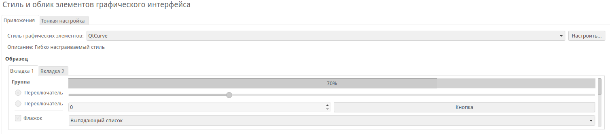

qtcurve-theme-neru-rosa
=======================

Стиль QtCurve для темы НЕРУ-РОСА

## Изображение (может немного отличатся от оригинала)

## Особенности

## Установка

Для KDE 5 Plasma `git clone https://github.com/chistota/qtcurve-theme-neru-rosa.git /usr/share/QtCurve`

## Сообщество
РОСПО Дизайн-студия
https://vk.com/rospodesign
